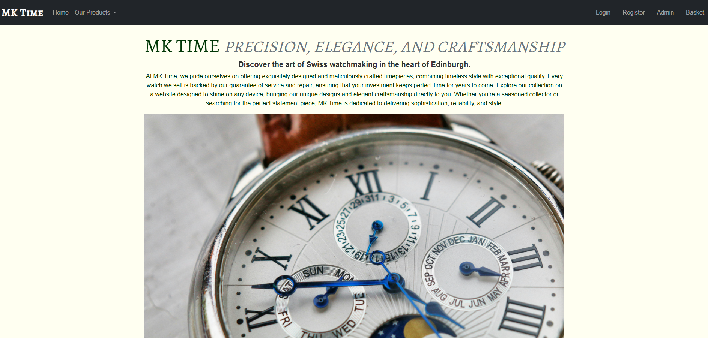
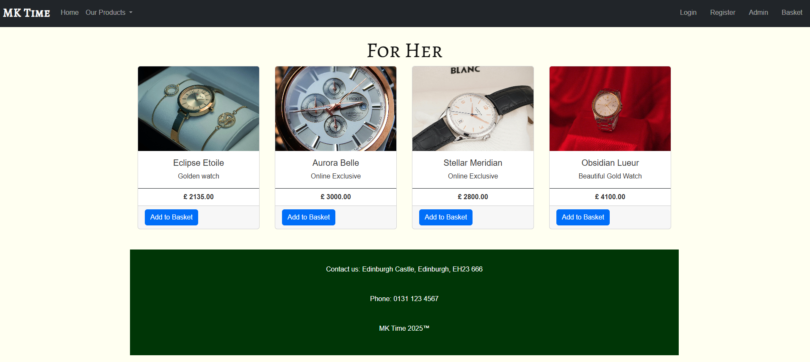
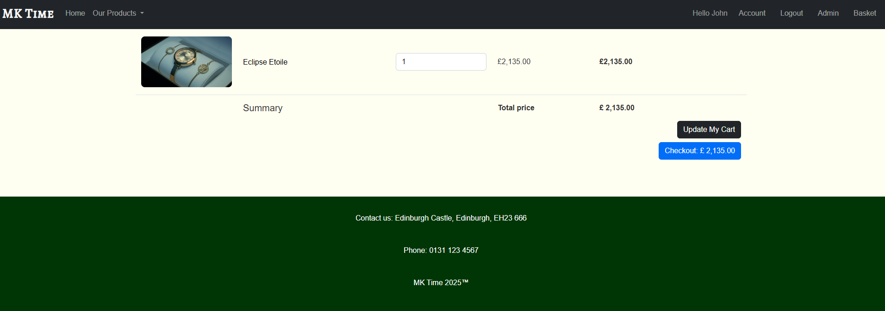
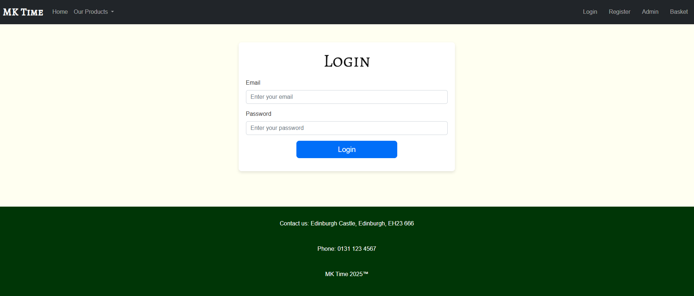

# ⌚ MK Time – Luxury Watch E-Commerce Store


A full-stack **PHP and MySQL e-commerce website** built as part of my Software Development studies.

**MK Time** is a luxury watch store project designed to simulate a real-world online shopping experience. It includes dynamic product listings, user registration and login, shopping basket functionality, and a responsive Bootstrap-based interface.

---

## 📖 Overview

This project was built to strengthen my understanding of full-stack web development and how the front end connects to a database-driven back end.

The aim was to create a stylish and functional e-commerce website that demonstrates:

- Dynamic content rendering with PHP
- Database integration using MySQL
- User registration and login
- Session-based basket functionality
- Modular PHP structure using reusable includes
- Responsive design with Bootstrap 5

---

## 🎥 Live Demo


---

## 🚀 Features

- Dynamic product catalogue
- Product data stored in a MySQL database
- User registration and login system
- Shopping basket functionality
- PHP session management
- Reusable PHP includes for cleaner structure
- Responsive design using Bootstrap 5
- Luxury watch themed branding and styling

---

## 🛠 Tech Stack

<p align="left">
  
  
  
  
  
  
  
  
</p>

### Frontend
- HTML5
- CSS3
- Bootstrap 5
- JavaScript

### Backend
- PHP
- MySQL

### Tools
- XAMPP
- VS Code
- Git
- GitHub

---

## 📂 Project Structure

```text
mk-time-ecommerce
│
├── css
│   └── style.css
│
├── images
│
├── screenshots
│   ├── homepage.png
│   ├── products.png
│   ├── basket.png
│   ├── login.png
│   └── mk-time-demo.gif
│
├── database
│   └── codespace.sql
│
├── connect_db.php
├── nav.php
├── index.php
├── products.php
├── basket.php
├── login.php
├── register.php
└── README.md
```

---

## 🗄 Database

The project uses a **MySQL database called `codespace`**.

The SQL file included in this project creates the database structure and inserts sample product data for the store.

### Included tables

- `products`
- `users`
- `orders`
- `order_contents`

### Notes

- Product sample data is included
- User and order data have been excluded for privacy and clean setup purposes

---

## ⚙ Installation

### 1. Clone the repository

```bash
git clone https://github.com/jmyles1604/mk-time-ecommerce.git
```

### 2. Move the project folder into your XAMPP `htdocs` directory

Example:

```text
C:\xampp\htdocs\mk-time-ecommerce
```

### 3. Start Apache and MySQL in XAMPP

Open the XAMPP Control Panel and start:

- Apache
- MySQL

### 4. Import the database

Open phpMyAdmin:

```text
http://localhost/phpmyadmin
```

Then import the SQL file located in:

```text
database/codespace.sql
```

This will create the `codespace` database and required tables.

### 5. Check your database connection

Make sure your `connect_db.php` file matches your local database settings.

Example:

```php
<?php

$link = mysqli_connect("localhost", "root", "", "codespace");

if (!$link) {
    die("Database connection failed: " . mysqli_connect_error());
}

?>
```

### 6. Open the project in your browser

```text
http://localhost/mk-time-ecommerce
```

---

## 📸 Project Preview

| Homepage | Products | Basket |
|---|---|---|
|  |  |  |

### Login Page


---

## 📊 Repository Stats


---

## 🔮 Future Improvements

- Payment gateway integration
- Admin dashboard for managing products
- Product search and filtering
- Order history for users
- Wishlist functionality
- Improved form validation
- Better error handling
- Deployment to a live hosting platform

---

## 👨‍💻 Author

**John Myles**  
Aspiring Software Developer  
Scotland, UK

GitHub: [jmyles1604](https://github.com/jmyles1604)

---

## ⭐ Support

If you like this project, feel free to **star the repository**.

---


